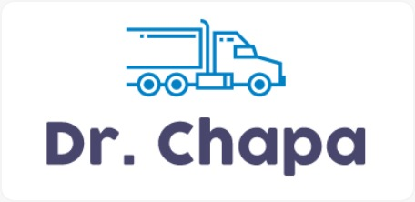

# Dr. Chapa

Dr Chapa é uma aplicação desenvolvida com Java e Spring Boot durante o evento Hackathon CCR.

## Aplicação Frontend
[Repositório](https://github.com/vinicius182/CCR-DrChapa)

## Dependências
* [Maven](https://maven.apache.org/)
* [PostgresSql](https://maven.apache.org/)
* [Firebase](https://firebase.google.com/)

## Instalação
Crie um projeto no Firebase para ter acesso ao Firebase para que seja possível utilizar a funcionalidade de envio de notificaçãoes
Após criar a conta navegue até a aba Configurações -> Conta de Serviços e clique em gerar nova chave privada.
Coloque o arquivo gerado na pasta ``resources`` dentro do projeto
Crie um banco de dados e atualize as configurações de conexão no arquivo ``application.properties``

## Iniciando a aplicação
Para iniciar a aplicação utilize o comando: ```mvn spring-boot:run```

## Principais funcionalidades
* Cadastro e autenticação de usuários
* Cadastro de veiculos
* Geração de relatório de viagens
* Cálculos de frete
* Notificação (Firebase)

## Funcionalidades futuras
* Notificações via Whatsapp
* Compartilhamento de eventos via Whatsapp
* Obter cupons
* Comandos de voz
* Histório de viagens
* Relatório de custos
* Relatório de lucro
* Relatório de saúde

## Time #244
* [Carlos Gizbert](https://www.linkedin.com/in/gizbert/)
* [Evandro Ignácio](https://www.linkedin.com/in/evandro-ignacio-658b4814b/)
* [Graziele Ignácio](https://www.linkedin.com/in/graziele-ign%C3%A1cio-3b857497/)
* [Murillo Santos](https://www.linkedin.com/in/murillosantosit/)
* [Vinícius Ferreira](https://www.linkedin.com/in/vinicius-ferreira-bb94a0105/)
